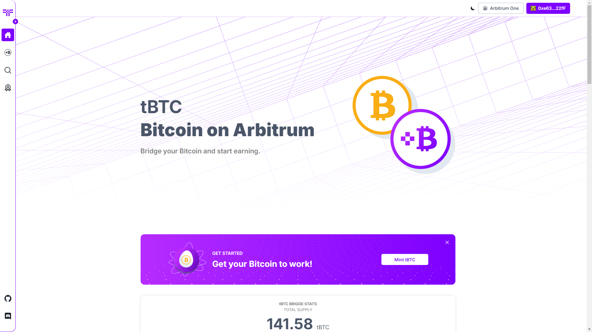

# Threshold tBTC minting portal. 💱

This platform allows you to efficiently mint Bitcoin on the Arbitrum network. Leverage Arbitrum’s scalability and low transaction fees to optimize your Bitcoin transactions. Our portal provides a streamlined experience for those looking to bridge Bitcoin into the Arbitrum ecosystem quickly and securely.

## How to start 💪

-   Clone repository with
    `git clone https://github.com/Unknown-Gravity/tbtc-arb-front.git`

-   install all the packages with
    `yarn`

> If you encounter an error installing the packages, just erase yarn.lock file and try again the yarn command

## ENV file ❗

To get started, please copy the code block below into your project.
Make sure to replace the placeholder RPC URLs with your own.
This step is crucial for ensuring that your application connects to the correct network endpoints.

```
# ##############################
# #   General Configuration    #
# ##############################
GENERATE_SOURCEMAP=false

# Get one here: https://cloud.walletconnect.com/sign-in
REACT_APP_WEB3MODAL_PROJECTID=<YOUR_WEB3MODAL_PROJECTID>
REACT_APP_MAINNET_CHAINID=42161
REACT_APP_TESTNET_CHAINID=421614

# ##############################
# #   API Keys and Endpoints   #
# ##############################
REACT_APP_API_KEY='<YOUR_DUNE_API_KEY>' #Dune API Key
COINGECKO_API_URL='https://api.coingecko.com/api/v3/simple/price' # tBTC REACT_APP_ARBISCAN_API_KEY='<YOUR_ARBISCAN_API_KEY>'
REACT_APP_ETHERSCAN_API_KEY='YOUR_ETHERSCAN_API_KEY'
REACT_APP_DUNE_URL='https://dune.com/threshold/tbtc'

# ##############################
# #       RPC Endpoints        #
# ##############################
# Ethereum
REACT_APP_ETH_MAINNET_RPC='<YOUR_ETH_MAINNET_RPC>'
REACT_APP_ETH_SEPOLIA_RPC='<YOUR_ETH_SEPOLIA_RPC>'

# ##############################
# #        Explorer URLs       #
# ##############################
# Mainnet
REACT_APP_BTC_EXPLORER_MAINNET='https://blockstream.info/'
REACT_APP_ETH_EXPLORER_MAINNET='https://etherscan.io/'
REACT_APP_ARB_EXPLORER_MAINNET='https://arbiscan.io/'

# Testnet
REACT_APP_BTC_EXPLORER_TESTNET='https://blockstream.info/testnet/address/'
REACT_APP_ETH_EXPLORER_TESTNET='https://sepolia.etherscan.io/'
REACT_APP_ARB_EXPLORER_TESTNET='https://sepolia.arbiscan.io/address/'

# ##############################
# #          API URLS          #
# ##############################

# Mainnet
REACT_APP_ARBISCAN_API_URL_MAINNET='https://api.arbiscan.io'
REACT_APP_ETHERSCAN_API_URL_MAINNET='https://api.etherscan.io'

# Testnet
REACT_APP_ARBISCAN_API_URL_SEPOLIA='https://api-sepolia.arbiscan.io'
REACT_APP_ETHERSCAN_API_URL_SEPOLIA='https://api-sepolia.etherscan.io'

# ##############################
# #     CONTRACTS ADDRESS      #
# ##############################
REACT_APP_TBTC_MAINNET = '0x6c84a8f1c29108F47a79964b5Fe888D4f4D0dE40'
REACT_APP_TBTC_TESTNET = '0xb8f31A249bcb45267d06b9E51252c4793B917Cd0'
REACT_APP_L1BITCOIN_SEPOLIA= '0xD9B523fb879C63b00ef14e48C98f4e3398d3BA2D'
REACT_APP_L1BITCOIN_MAINNET= '0x75A6e4A7C8fAa162192FAD6C1F7A6d48992c619A'
REACT_APP_L2BITCOIN_SEPOLIA= '0xB2fEC598a9374078Bb639f3d70555fc4389b7a78 '
REACT_APP_L2BITCOIN_MAINNET= '0x1C8d7b744b474c080faADd5BF9AD965Be4258F9e'

# ###########################################
# #     IPFS Loyalty Program Endpoints      #
# ###########################################
REACT_APP_LOYALTY_PROGRAM_API_URL='<YOUR_LOYALTY_PROGRAM_API_URL>'
```

## Start the project 👌

Run `yarn start` and a window will automatically open to with the project. You can also open http://localhost:3000/

### Home page

<picture>
   
</picture>

# Build Project 🏗️

Run `yarn build`
